# Demo Quick Start
This document describes how to quickly run the TRTC Plugin demo for Unreal Engine.
To run this demo, you need to:

1. Download the latest LiteAVSDK for UE from [Here](https://liteav.sdk.qcloud.com/customer/ue5/LiteAVSDK_10.3_UE5.zip). And copy the unzipped folders(**TRTCSDK** and **UserSig**) into **Plugins/TRTCPlugin/Source**.
2. Setup Unreal Engine 5 develope environment.
3. Compile and run.

## Setup Unreal Engine 5 develope environment.
### Environment Requirement
- Unreal Engine 5.0.3 or above.
- macOS
	- macOS Monterey or later.
	- Xcode 12.4 or later.
	- Android NDK r21e
- Windows
	- Windows 10 64-bit version 1909 revision .1350 or higher, or versions 2004 and 20H2 revision .789 or higher.
	- Visual Studio 2019 v16.11.5 or later (recommended).

For more UE5 installation detail and hardware/software specifications, please visit the [UE documents]( 
https://docs.unrealengine.com/5.0/en-US/installing-unreal-engine/).

## Compile and run

### Prerequisites
You have [signed up for a Tencent Cloud account](https://www.tencentcloud.com/). Create an Application and then update the demo project configs.

1. Log in to the TRTC console and select Development Assistance > Demo Quick Run.
2. Select New and enter an application name such as TestTRTC. If you have already created an application, select Existing.
3. Add or edit tags according to your actual business needs and click Create.
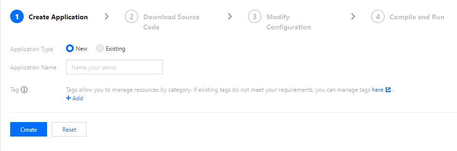
4. Go to /TRTCPlugin/Source/UserSig/include/DebugDefs.h.
5. Set parameters in DebugDefs.h as follows:
> SDKAPPID: `0` by default. Set it to the actual `SDKAppID`.
> SECRETKEY: left empty by default. Set it to the actual key.

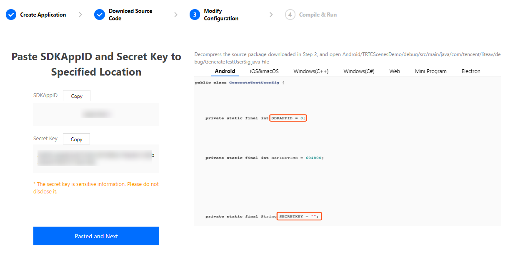


### iOS/Android/macOS App Development on macOS

#### 1. Opening TRTCPluginDemo project

1.1 Launch Unreal Editor With Epic Games Launcher

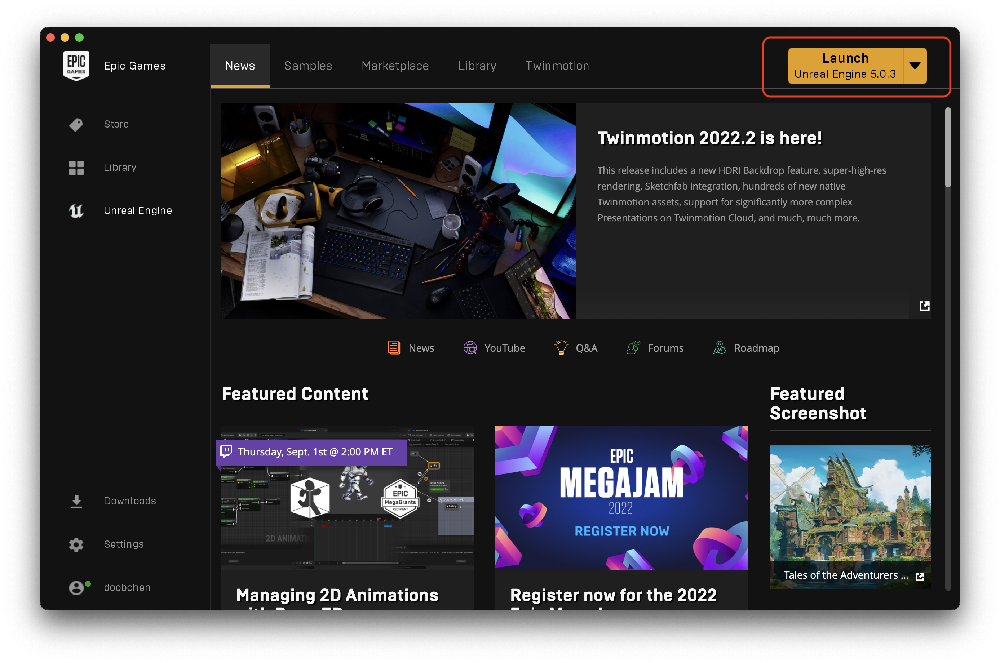

1.2 Open TRTCPluginDemo

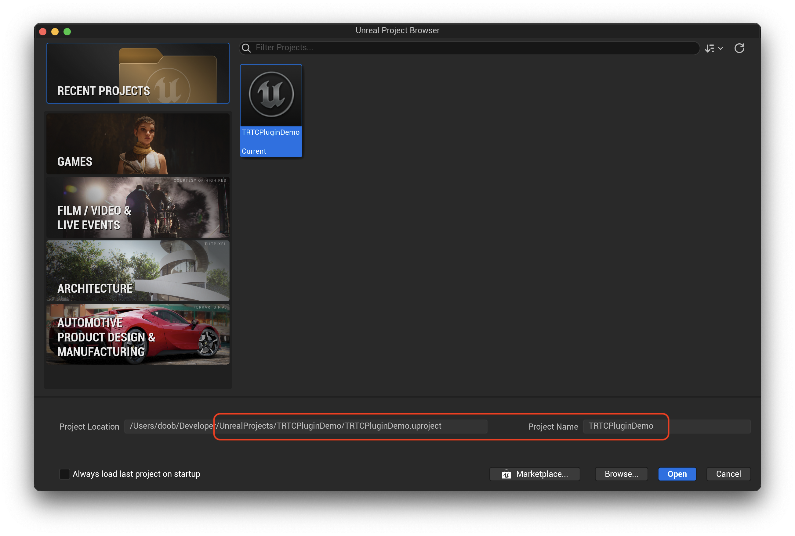

1.3 Rebuild Project. This step runs using a background task and may take a few minutes. 

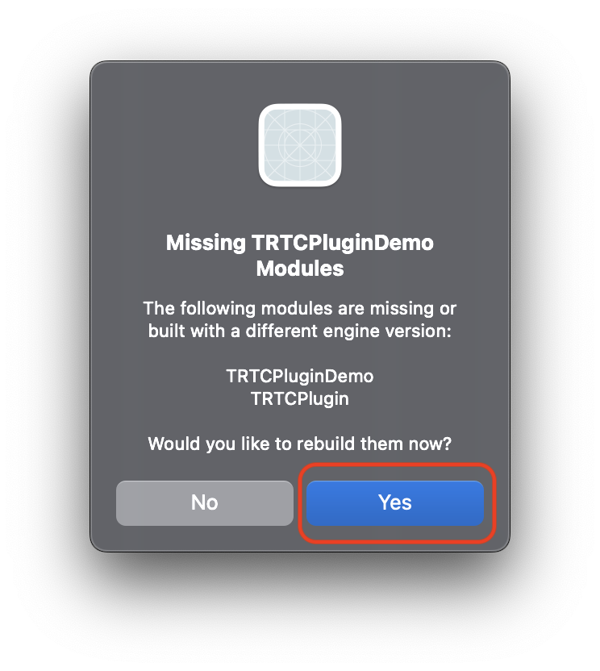

1.4 Open UnrealEditor

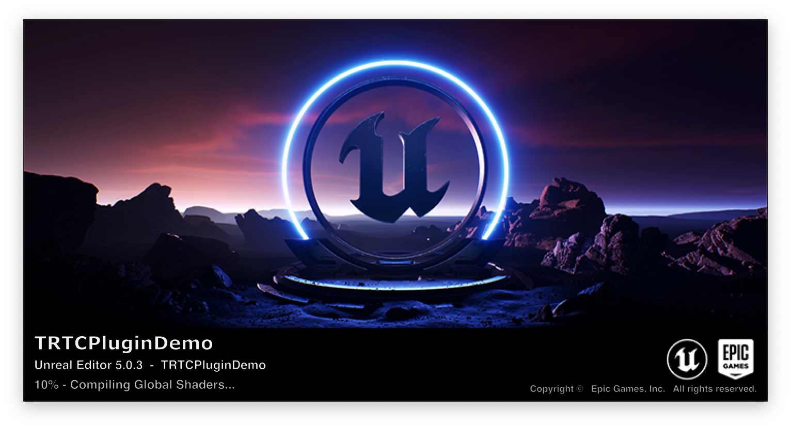

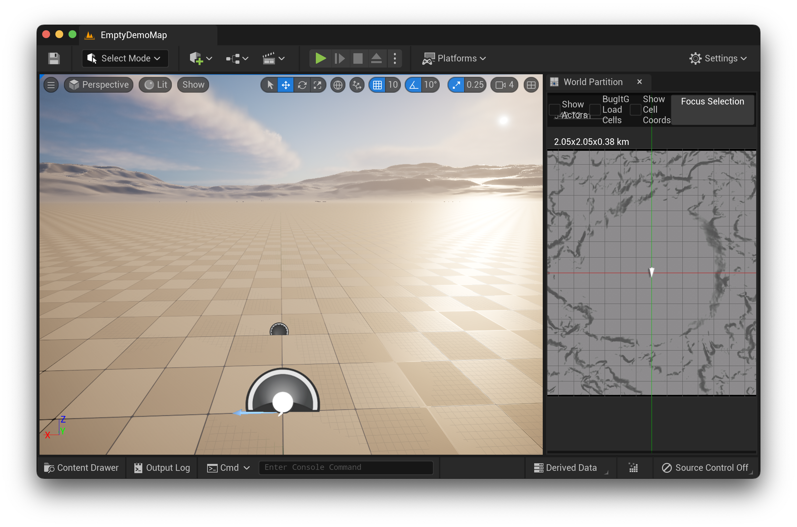

#### 2. Quick Launch On Target Platform/Devices

##### 2.1 iOS
Go to *Project Setting -> Platforms -> iOS*. Make sure you already have a valid mobile provision and certificate. Sometime you also need to update the *Bundle Identifier* to meet the provision requirements.

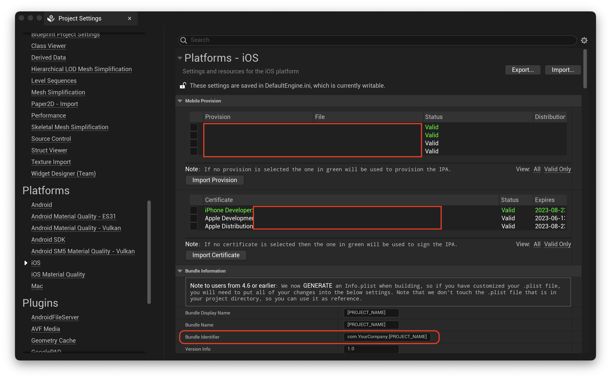

Quick Launch on your iOS device

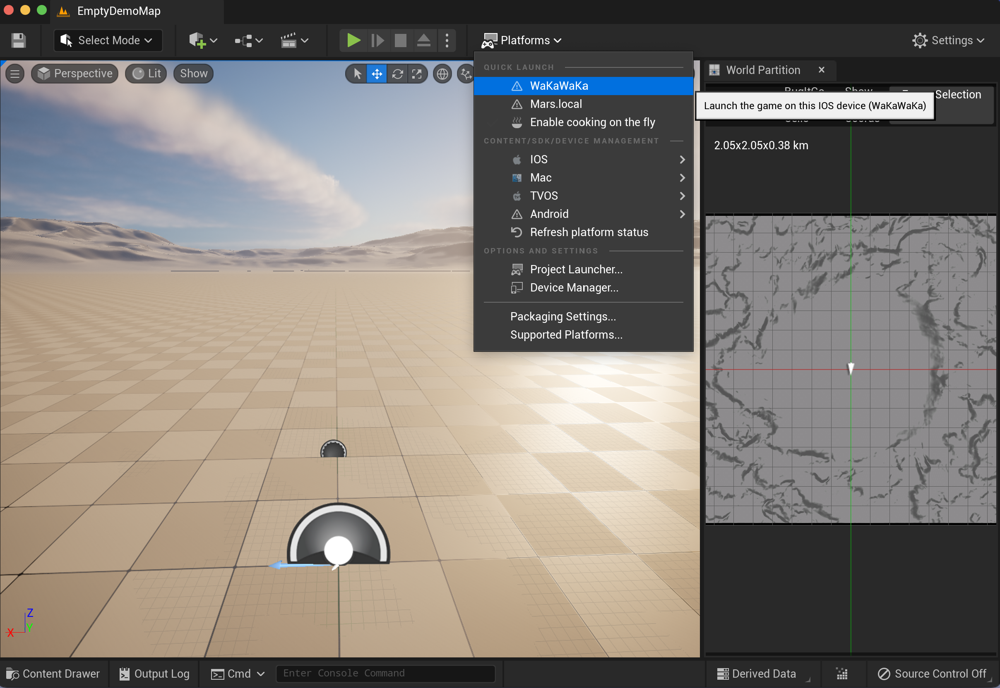
<!--  -->

##### 2.2 Android
For more Android development requirements, please check the [UE document](https://docs.unrealengine.com/5.0/en-US/android-development-requirements-for-unreal-engine/).
Quick launch on your connected android devices.

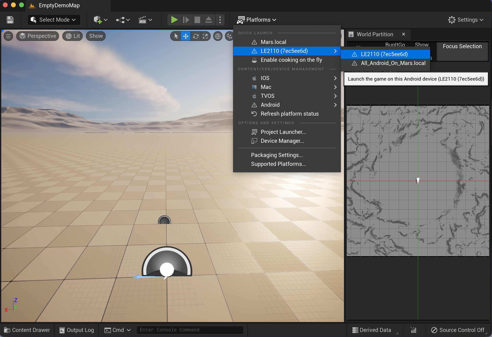

On some android devices, it cannot not launch the app automatically. Please try *Quick Launch* again or open app manually.
On another android devices, an alert may appear like this:

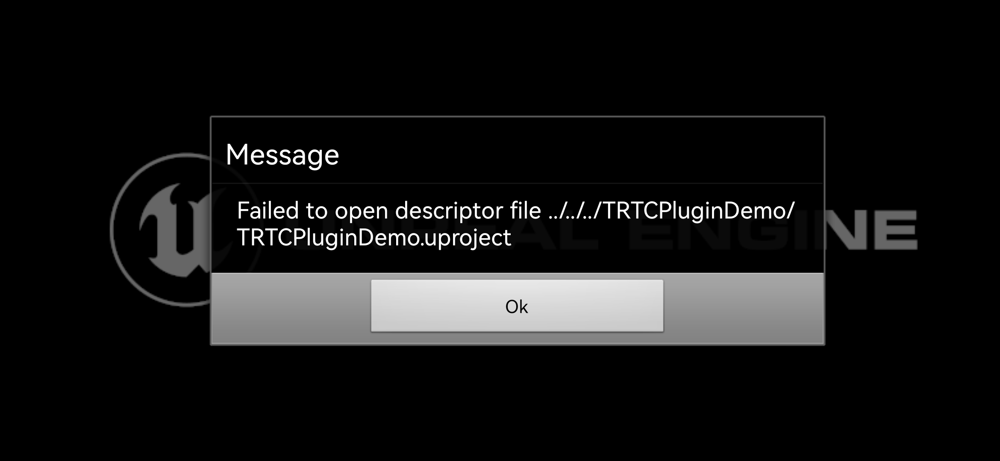

There can be many different reason for this failure, you have to check your project setting carefully.
This is one of our workarounds.
Package android project and install with the `Install_TRTCPluginDemo-arm64.command` script.

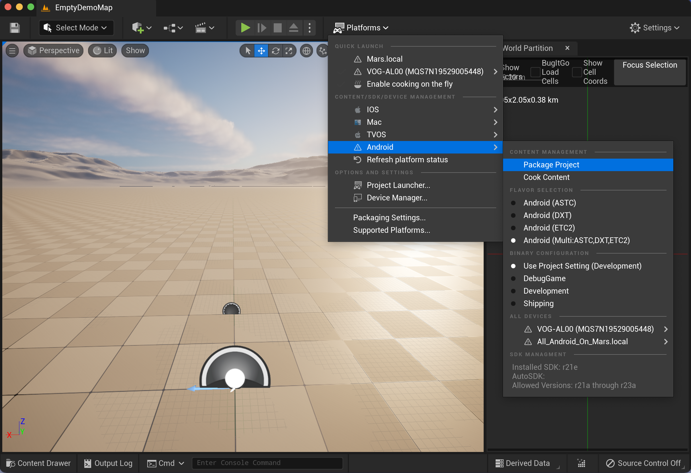

If everything is working correctly, you may see something like the following after granting camera and microphone access.

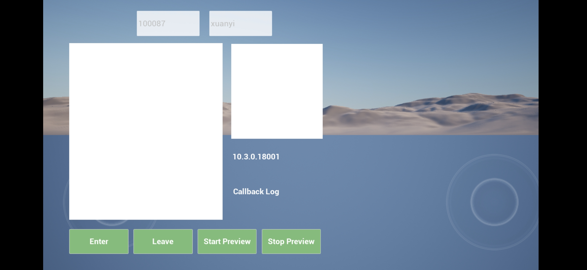

###### 2.3 macOS
Currently, the easiest way to run the Mac demo is packaging an Mac app and update package content with the `CopyFrameworkAndUpdateInfoPlistForMac.sh` script.

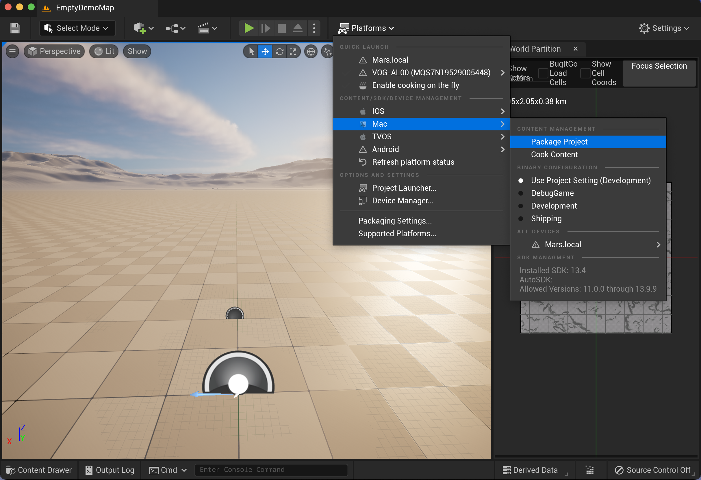

```
cd <Path to Demo Folder>
./CopyFrameworkAndUpdateInfoPlistForMac.sh /<Path to Package Folder>/Mac/TRTCPluginDemo.app
```

There is also a workaround to run the demo directly from the Unreal Editor.

Step1 Grant `kTCCServiceCamera` and `kTCCServiceMicrophone` access to `com.epicgames.UnrealEditor` by modify `~/Library/Application Support/com.apple.TCC.db`.

Step2 *Tools -> Generate Xcode Project* and then open and run the generated `TRTCPluginDemo.xcworkspace`.

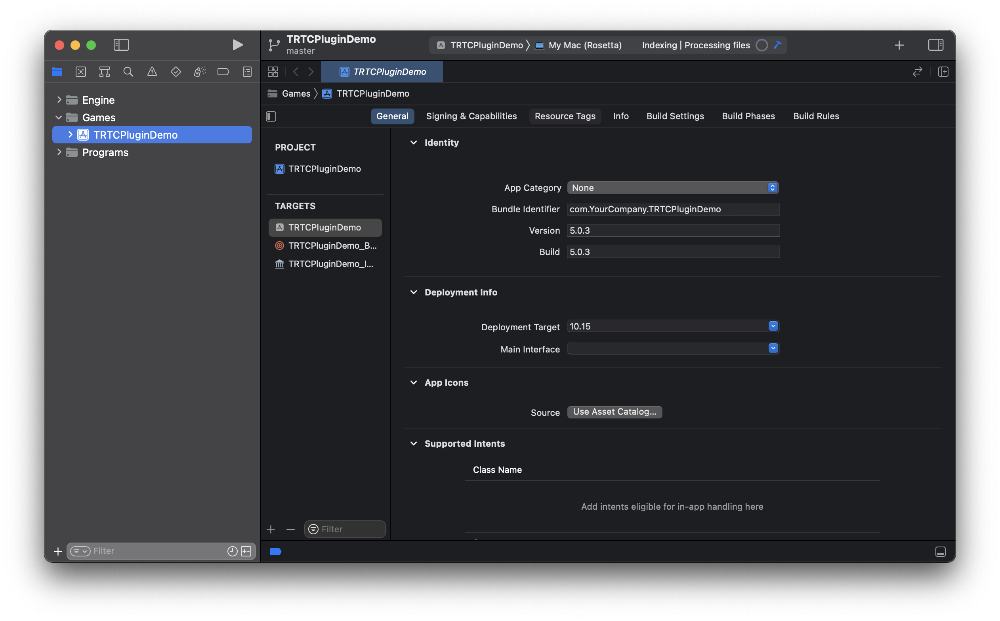

Step3 Play in editor

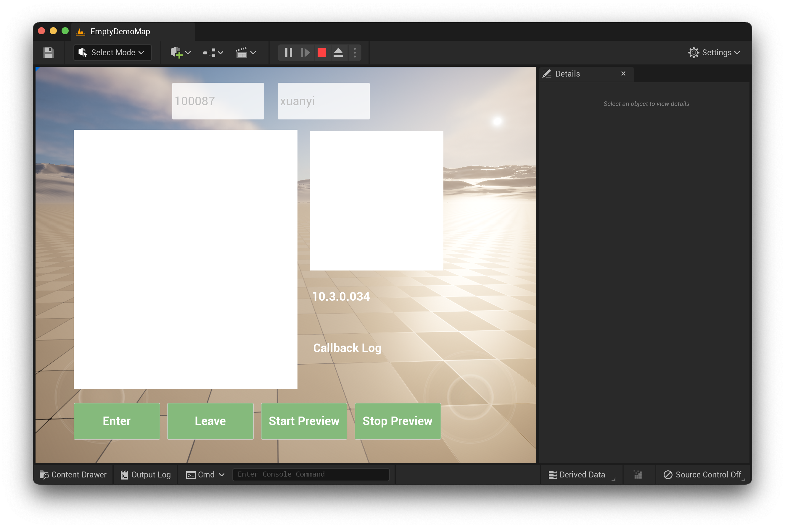

### Windows App Development

#### 1. Opening project from disk and rebuild project

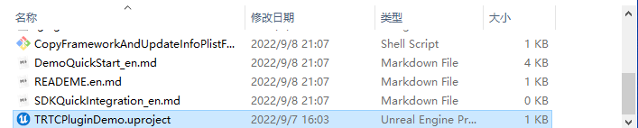
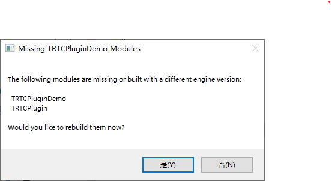

#### 2. Play In Editor

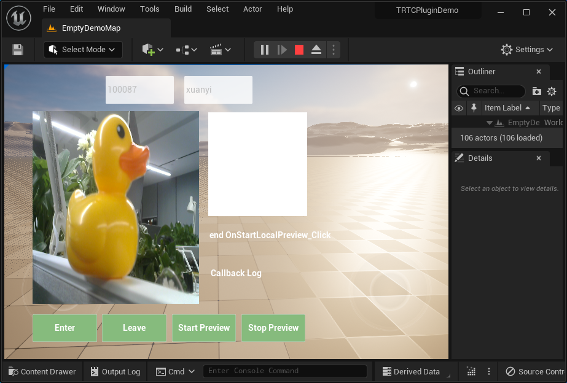